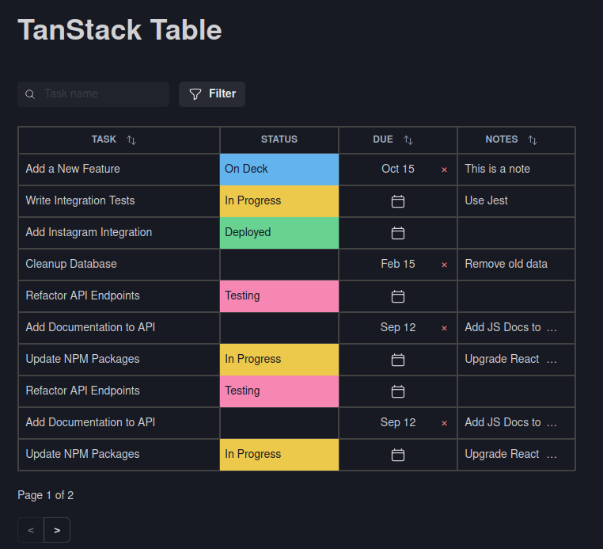

# React TanStack Table Project

This is a simple project demonstrating a basic implementation of data tables using the [React TanStack Table](https://tanstack.com/table/v8) library. The project includes a table component with features like sorting, filtering, and pagination, allowing users to interact with data easily.




## Features

- **Sortable Columns**: Click on column headers to sort data in ascending or descending order.
- **Filtering**: Basic column-level filters to narrow down data.
- **Pagination**: Navigate through data pages seamlessly.

## Getting Started

### Prerequisites

To run this project, you need [Node.js](https://nodejs.org/) installed.

### Installation

1. **Clone the repository**:
   ```bash
   https://github.com/kiplrry/TanstackTables.git
   ```

2. **Navigate into the project directory**:
   ```bash
   cd TanstackTables
   ```

3. **Install dependencies**:
   ```bash
   npm install
   ```

### Running the Project

To start the project, run:

```bash
npm run dev
```

### Customizing the Table

You can extend functionality by adding more columns, filters, or other custom options. For further customization, refer to the [TanStack Table documentation](https://tanstack.com/table/v8).


## Acknowledgements

 - [NiKitadev YT](https://github.com/nikitadev-yt/react-table-tutorial.git)
